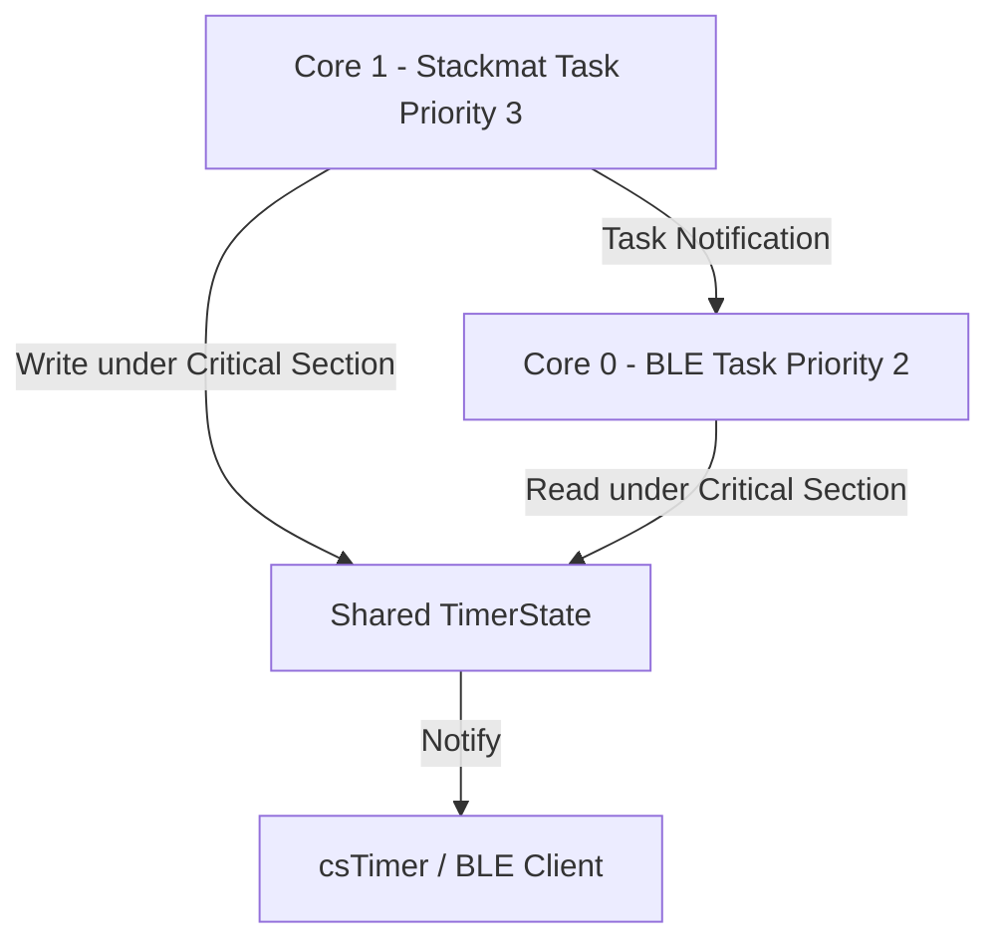

# StackmatLink Project Specification & AI Conventions (GEMINI.md)

本文件是 **StackmatLink** 项目的核心技术规格书、设计规约以及 AI 助手开发规范。任何在此工作区工作的 AI 助手在执行任何操作前，**必须**完整阅读并严格遵守本文件所规定的所有约定。

---

## 目录
1. [项目概览 (Project Overview)](#1-项目概览-project-overview)
2. [硬件架构与接线 (Hardware Architecture & Wiring)](#2-硬件架构与接线-hardware-architecture--wiring)
3. [核心技术栈 (Key Technologies)](#3-核心技术栈-key-technologies)
4. [固件架构与并发设计 (Firmware Architecture & Concurrency)](#4-固件架构与并发设计-firmware-architecture--concurrency)
5. [Stackmat Gen4 信号解析规约 (Stackmat Signal Parsing)](#5-stackmat-gen4-信号解析规约-stackmat-signal-parsing)
6. [GAN Smart Timer BLE 协议规约 (GAN BLE Protocol)](#6-gan-smart-timer-ble-协议规约-gan-ble-protocol)
7. [AI 助手工作规范与自主边界 (AI Working Protocols & Redlines)](#7-ai-助手工作规范与自主边界-ai-working-protocols--redlines)
8. [开发与编译指南 (Build & Run)](#8-开发与编译指南-build--run)
9. [故障排除 (Troubleshooting)](#9-故障排除-troubleshooting)
10. [常见问题与更新日志 (FAQ & Changelog)](#10-常见问题与更新日志-faq--changelog)

---

## 1. 项目概览 (Project Overview)

**StackmatLink** 是一个运行在 **ESP32-S3** 芯片上的开源蓝牙 (BLE) 桥接器。它能够捕获标准 Stackmat 计时器通过 3.5mm 音频口输出的弱模拟信号，经过硬件比较器（LM393）进行波形整形为数字信号后，由 ESP32-S3 解析，并封装转换成 **GAN 官方智能计时器 (GAN Smart Timer) 蓝牙协议**。

该桥接器使得非蓝牙的标准计时器（如 GAN Halo 星环计时器、Speed Stacks 计时器等）可以被 **csTimer** 等支持 GAN 官方蓝牙计时器的应用程序完美识别和同步，实现零延迟、免线缆的无线计时体验。

---

## 2. 硬件架构与接线 (Hardware Architecture & Wiring)

物理信号流：
`Timer Output (Analog Audio ~0.7V-2.5V)` ➡️ `LM393 IN+` vs `IN- (1.65V Divider Ref)` ➡️ `Digital Square Wave (0V/3.3V)` ➡️ `ESP32-S3 UART RX (GPIO 4)` ➡️ `NimBLE BLE Notify` ➡️ `csTimer (Web Bluetooth)`

### 2.1 接线定义
- **LM393 供电**：VCC ➡️ `3.3V`，GND ➡️ `GND`。
- **LM393 比较端**：
  - `IN+` ➡️ 3.5mm 音频尖端 (Tip)
  - `IN-` ➡️ 1.65V 参考电压（通过 3.3V 对地串联两个 10kΩ 电阻分压获得）
- **LM393 输出端**：`Output` ➡️ ESP32-S3 `GPIO 4`。
  - **重要**：由于 LM393 是开漏输出 (Open-Drain)，**必须**在 Output 与 3.3V 之间接入一个 **10kΩ 上拉电阻**。
- **指示灯 DI**：板载 NeoPixel (WS2812) ➡️ ESP32-S3 `GPIO 48`。

---

## 3. 核心技术栈 (Key Technologies)

- **主控芯片**：ESP32-S3 (双核 Tensilica LX7，主频 240MHz)
- **开发框架**：Arduino (C++) / PlatformIO
- **蓝牙库**：`NimBLE-Arduino` (相比原生 Bluedroid 占用更少的 RAM/Flash，运行更稳定)
- **外设库**：`Adafruit_NeoPixel` (用于控制板载 WS2812 状态灯)
- **操作系统**：FreeRTOS (双核任务调度)

---

## 4. 固件架构与并发设计 (Firmware Architecture & Concurrency)

为了保证毫秒级的实时性与蓝牙传输的吞吐量，系统采用 **FreeRTOS** 进行双核任务分工，完美实现计算与通讯的物理隔离：



### 4.1 任务分工
1. **Core 1 – Stackmat 解析任务 (`stackmatTask`, 优先级 3)**：
   - 高优先级，排他性运行于 Core 1。
   - 负责通过硬件串口 (UART1) 监听 `GPIO 4`，对 1200 Baud 的 Stackmat 串口字节流进行实时分包、验证与状态推断。
   - 检测到状态切换或数值更新时，更新共享状态，并通过 `xTaskNotifyGive` 触发 BLE 任务。
2. **Core 0 – BLE 通讯任务 (`bleTask`, 优先级 2)**：
   - 运行于 Core 0，与 ESP32 蓝牙协议栈同核。
   - 阻塞在 `ulTaskNotifyTake`。一旦收到解析任务的通知，立即从共享状态读取最新数据，组装 GAN BLE 数据包并进行特征值通知发送 (`pNotifyCharacteristic->notify()`)。

### 4.2 线程安全与互斥 (Concurrency Control)
由于两核并发读写同一个结构体 `currentTimer`，系统采用 `portMUX_TYPE` 自旋锁进行临界区保护，禁止中断与多核冲突：
```cpp
portMUX_TYPE dataMux = portMUX_INITIALIZER_UNLOCKED;

// 写共享变量
portENTER_CRITICAL(&dataMux);
currentTimer.state = newState;
currentTimer.min = m; currentTimer.sec = s; currentTimer.ms = ms;
currentTimer.needsNotify = true;
portEXIT_CRITICAL(&dataMux);
```

### 4.3 状态指示灯逻辑 (NeoPixel GPIO 48)
- 🔵 **蓝色 (Blue, Color(0, 0, 40))**：计时器正在计时中 (`GAN_RUNNING`)，指示灯常亮。
- ⚪ **白色 (White, Color(50, 50, 30))**：计时器准备就绪或重置 (`GAN_RESET`)，指示灯闪烁模式（亮起 80ms 后自动熄灭）。

---

## 5. Stackmat Gen4 信号解析规约 (Stackmat Signal Parsing)

### 5.1 串口格式
- 波特率：**1200 Baud**
- 校验配置：**8N1**（8数据位，无校验，1停止位）
- 信号相位：**自适应反相**
  - LM393 的具体接线或三极管倒相电路可能导致输出波形的极性倒置。
  - 固件默认以反相模式 (`inverted = true`) 启动串口。
  - **自适应逻辑**：若持续 3000ms 未收到任何有效数据包，自动翻转 `inverted` 标志并重新初始化串口。

### 5.2 数据包结构 (10 字节)
每帧包含 10 个字节的 ASCII 编码数据：
- **Byte 0**：状态字符
  - `'A'`：准备就绪 (Get Set)
  - `'S'`：停止 (Stopped / Finished)
  - `'L'` / `'R'` / `'C'`：手触碰左/右/双侧传感器 (Hands On)
  - `' '` / `'I'`：未触碰传感器或空闲 (Hands Off / Idle)
- **Byte 1**：分钟数 (Digit)
- **Byte 2-3**：秒数 (Digits)
- **Byte 4-6**：毫秒数 (Digits)
- **Byte 7**：和校验字节 (Checksum)
  - 计算公式：`Checksum = 64 + (Byte[1..6] 所有数字字符相加的值)`。
  - 例：时间为 `0:01.234`，数字和为 `0+0+1+2+3+4 = 10`，校验字节应为 `64 + 10 = 74` (ASCII 字符 `'J'`)。
- **Byte 8-9**：结束符（一般为 `\r\n`，依靠 15ms 字节超时自动切分数据包边界）。

### 5.3 智能状态推断 (State Inference)
GAN Halo 星环等计时器在空闲或无手触碰时会发出 `'I'` 或 `' '` 等状态码。为完美兼容 csTimer，固件实现了动态时间戳推断：
- 若时间 `currentTotalMs == 0`，推断为 `GAN_RESET` (重置/就绪)。
- 若时间不为 0 且当前时间较上一帧有变化，推断为 `GAN_RUNNING` (计时中)。
- 若时间不为 0 且时间相对上一帧停止变化，推断为 `GAN_STOPPED` (停止)。
- **预通知机制**：在收到包的第 1 个字节 (Header) 时，若是 `'A'` (Get Set)、`'L'/'R'/'C'` (Hands On)、`'S'` (Stopped)，则提前触发蓝牙发送，降低延迟。

---

## 6. GAN Smart Timer BLE 协议规约 (GAN BLE Protocol)

StackmatLink 必须完美模拟 GAN 官方蓝牙计时器。

### 6.1 GATT 服务与特征值
- **Service UUID**：`0000fff0-0000-1000-8000-00805f9b34fb`
- **Characteristic UUID**：`0000fff5-0000-1000-8000-00805f9b34fb` (属性：`NOTIFY`)
- **广播名称**：`GAN-Timer`

### 6.2 蓝牙通知数据包结构 (10 字节)
每一包通过 Notify 特征值发送的数据结构如下：

| 字节偏移 | 字段名称 | 字节值 / 说明 |
| :--- | :--- | :--- |
| `Byte 0` | Magic Header LSB | `0xFE` |
| `Byte 1` | Magic Header MSB | `0x01` |
| `Byte 2` | `pkgIndex` | **滚动数据包序号** (0~255 循环递增)，用于防重滤除 |
| `Byte 3` | `state` | **GAN 计时状态码** (详见下表) |
| `Byte 4` | `min` | 分钟组件 (UINT8) |
| `Byte 5` | `sec` | 秒钟组件 (UINT8) |
| `Byte 6` | `ms_lsb` | 毫秒低位字节 (`ms & 0xFF`) |
| `Byte 7` | `ms_msb` | 毫秒高位字节 (`(ms >> 8) & 0xFF`) |
| `Byte 8` | `crc_lsb` | CRC16 校验低位字节 (`crc & 0xFF`) |
| `Byte 9` | `crc_msb` | CRC16 校验高位字节 (`(crc >> 8) & 0xFF`) |

### 6.3 GAN 状态码定义 (`state`)
```cpp
enum GanState {
    GAN_DISCONNECT = 0, // 断开连接
    GAN_GET_SET    = 1, // 准备就绪 (手放在计时器上，灯变绿)
    GAN_HANDS_OFF  = 2, // 手离开计时器 (准备开始，非计时状态)
    GAN_RUNNING    = 3, // 正在计时
    GAN_STOPPED    = 4, // 计时停止
    GAN_RESET      = 5, // 计时器已重置 (显示 0.000)
    GAN_HANDS_ON   = 6, // 手放在计时器上 (未完全 Ready / 触碰传感器)
    GAN_FINISHED   = 7  // 计时结束状态
};
```

### 6.4 CRC 校验规则 (CRC16/CCITT-FALSE)
数据包的最后 2 字节（`Byte 8-9`）是对中间 6 个字节（`Byte 2` 到 `Byte 7`）进行 CRC 校验计算后的结果。
- **校验算法**：`CRC-16/CCITT-FALSE`
- **生成多项式 (Poly)**：`0x1021` ($x^{16} + x^{12} + x^{5} + 1$)
- **初始值 (Init)**：`0xFFFF`
- **输入输出反转 (Ref)**：False (不反转)
- **示例算法实现**：
```cpp
uint16_t crc16ccitt(uint8_t* data, size_t len) {
    uint16_t crc = 0xFFFF;
    for (size_t i = 0; i < len; i++) {
        crc ^= (uint16_t)data[i] << 8;
        for (uint8_t j = 0; j < 8; j++) {
            if (crc & 0x8000) crc = (crc << 1) ^ 0x1021;
            else crc <<= 1;
        }
    }
    return crc;
}
```

---

## 7. AI 助手工作规范与自主 boundaries (AI Working Protocols & Redlines)

在处理此项目时，AI 助手必须无条件执行本章的工程规矩与规则。

### 7.1 通讯规范
- **默认语言**：**简体中文**。对于代码、指令和变量名使用**英文**。
- **结论先行**：给出方案时直接提供核心结论，拒绝冗长的前垫和客套废话。
- **无奉承**：严禁吹捧用户的创意（例如禁止说“您这个想法太棒了”、“Certainly”等废话）。

### 7.2 严格红线边界 (Redlines - 必须事前询问并获得批准)
即使在自动接受模式下，在执行以下敏感操作前也 **必须暂停并获得用户的显式批准**：
1. **删除文件/目录** 或篡改 `git` 历史记录。
2. 修改环境配置文件 `.env`、秘钥密钥、Tokens 或 CI/CD 工作流。
3. 更改物理/逻辑数据库 Schema 或进行数据迁移。
4. 运行 `git push`、`git rebase`、`git reset --hard` 等危险 Git 指令。
5. 安装全局系统依赖或篡改系统全局配置。
6. 公开发布（如 `npm publish`，生产部署，发布文章等）。

### 7.3 工程规范 (Constraints First)
- 任何重大的架构或逻辑改动，**必须首先在 Plan 模式下** 撰写 `implementation_plan.md`，获得批准后方可执行。
- 绝不允许通过注释掉错误、使用 "bypass" 临时标志来强行运行代码；必须追溯根本原因并彻底修复。
- 严禁将密码、密钥、访问 Tokens 写入代码库、提交记录或调试日志中。
- 代码更改后，**必须立即验证构建是否成功**。

### 7.4 源码规范与出处声明 (Source Header Protocol)
任何新建的代码文件，或修改的主程序，**必须保留或包含以下版权声明前缀**：
```cpp
/**
 * StackmatLink - Bluetooth (BLE) Bridge for Stackmat Timers
 * 
 * Copyright (c) 2026 liusonwood
 * Licensed under the MIT License
 *
 * 开源精神声明：本项目由 liusonwood 最初构思并制作。
 * 任何针对本项目的二次开发、修改或分发，均须遵守 MIT 开源协议并保留本版权声明。
 */
```

---

## 8. 开发与编译指南 (Build & Run)

### 8.1 库依赖
本固件依赖以下外部库，请在 PlatformIO / Arduino 库管理器中安装：
1. **NimBLE-Arduino** (安装版本 $\ge 1.4.0$)
2. **Adafruit NeoPixel**

### 8.2 PlatformIO 配置参考
如果您使用 PlatformIO，可在 `platformio.ini` 中使用以下配置：
```ini
[env:esp32s3]
platform = espressif32
board = esp32-s3-devkitc-1 ; 或具体的板型，如 super_mini_esp32s3
framework = arduino
monitor_speed = 115200
lib_deps =
    h2zero/NimBLE-Arduino@^1.4.1
    adafruit/Adafruit NeoPixel@^1.12.0
build_flags = 
    -D ARDUINO_USB_CDC_ON_BOOT=1 ; 启用硬件 USB CDC 输出调试信息
```

### 8.3 编译与烧录
- **Arduino IDE**：选择 `ESP32S3 Dev Module` ➡️ 配置对应的 Flash 大小和 `USB CDC On Boot` ➡️ 点击 **Upload**。
- **PlatformIO**：在终端运行 `pio run -t upload`。

---

## 9. 故障排除 (Troubleshooting)

- **csTimer 无法搜索到蓝牙设备**：
  1. 检查 `stackmatlink.ino` 中的 `SERVICE_UUID` 是否匹配官方 GAN 计时器 UUID。
  2. 使用手机端 BLE 调试工具（如 LightBlue）搜索 `GAN-Timer`，确认广播包内包含服务 `0xFFF0`。
  3. 确认客户端浏览器（如 Chrome）已启用并支持 Web Bluetooth。
- **指示灯不亮且无数据输出**：
  1. 用万用表测量 LM393 的 `Output`（GPIO 4）引脚。如果有音频输入，该引脚应有明显的电压脉冲，空闲时应稳定在 `3.3V`。
  2. 确认上拉电阻是否已经妥善连接。
  3. 确保 NeoPixel 对应的引脚为 `GPIO 48`，且地线接好。

---

## 10. 常见问题与更新日志 (FAQ & Changelog)

### FAQ
**Q：为什么选用 NimBLE 而非原生 BLE 库？**
A：ESP32 的原生 Bluedroid 协议栈极其庞大，会吃掉近 100KB 的 RAM 以及大比例的 Flash 空间，这极易引发双核运行时的堆栈溢出。NimBLE 能够节省约 50% 内存开销，同时连接与广播响应更为迅速。

**Q：如何验证我的计时器物理输出被完美识别？**
A：使用示波器或逻辑分析仪检查 `GPIO 4`。当计时器未开机时，它应为高电平；当计时器开机并工作时，应呈现非常纯净的 1200 Baud (1位宽约 833微秒) 方波。

---
*规范文件编写：Antigravity AI Assistant & liusonwood*
