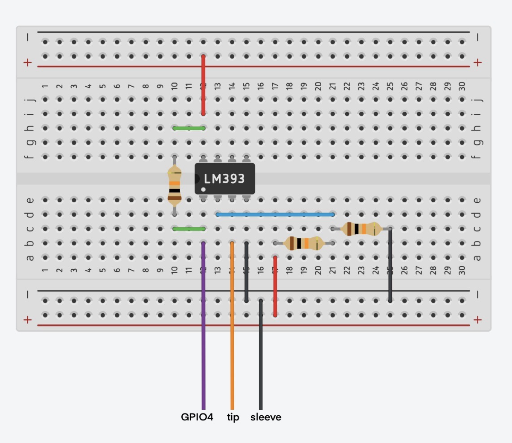
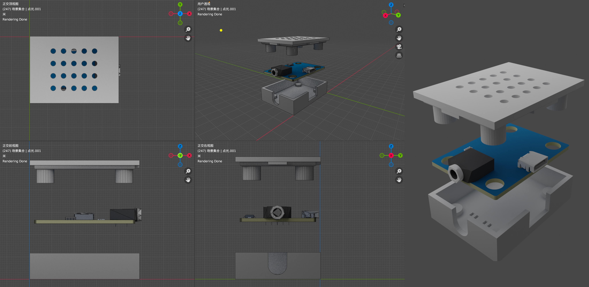
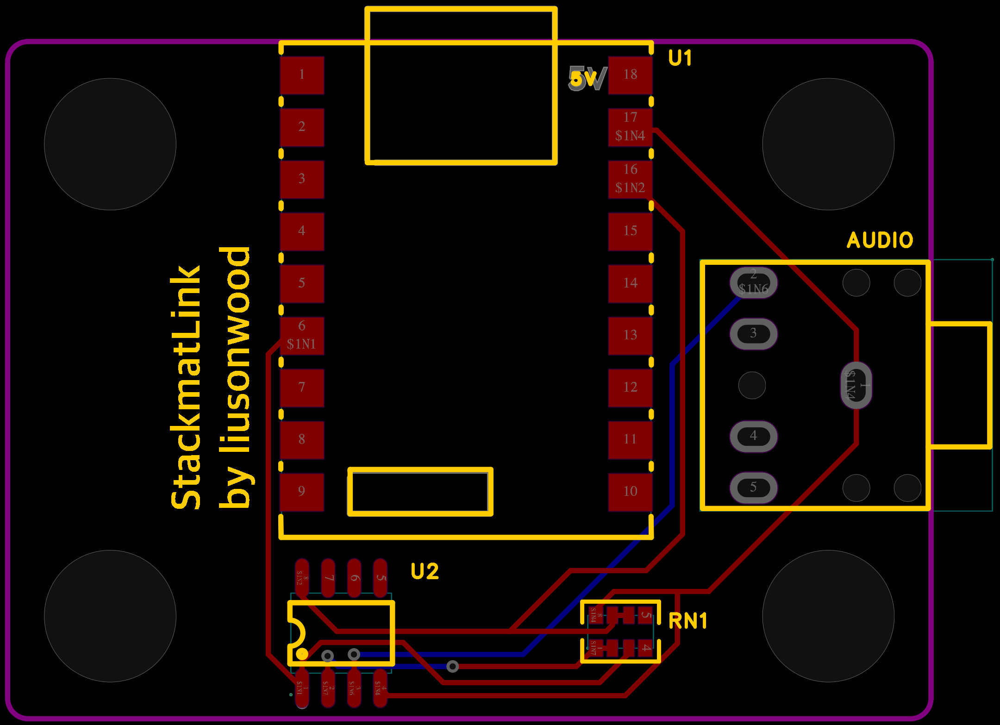

# StackmatLink

🌐 [English](./README.md) | [简体中文](./README_ZH.md)

---
# Stackmat魔方计时器 -> BLE 蓝牙转换器

这是一个基于 **ESP32-S3** 的开源项目，旨在将 **GAN Halo (星环)** 计时器通过音频口输出的模拟 Stackmat 信号，实时转换为 **GAN Smart Timer 蓝牙协议**。

通过该项目，您可以让任何标准 Stackmat 魔方计时器（本项目使用GAN Halo 计时器）通过蓝牙连接到的 **csTimer**，实现自动同步成绩，无需购买昂贵的蓝牙版。

## 🌟 核心特性

- **协议转换**：将 Stackmat Gen4 (1200 Baud) 信号转换为 GAN 官方蓝牙协议（包含 0xFE 魔数包及 CRC16 校验）。
- **智能状态推断**：针对 GAN Halo 特有的 `'I'` 状态码，通过时间轴动态判定 `Running`（运行）和 `Stopped`（停止）状态，解决 csTimer 识别障碍。
- **双核并发处理**：
    - **Core 1**：负责 1200 波特率的高精度信号实时采样与解析。
    - **Core 0**：负责 NimBLE 蓝牙堆栈和成绩通知（Notify），确保数据零延迟传输。
- **自动相位纠正**：具备自动检测信号反相（Inverted）并纠正的功能，极大提高不同硬件电路的兼容性。
- **增强可见性**：优化了 BLE 广播参数，确保 Mac Chrome 浏览器和 iPad csTimer 能快速发现并连接设备。
- **连接鲁棒性**：采用轮询连接数（getConnectedCount）机制，解决部分系统下蓝牙连接回调延迟的问题。

## 🛠 硬件需求

- **MCU**: ESP32-S3 (测试使用 N16R8 版本，PCB焊接使用 **ESP32-S3-SuperMini** 版本，但全系列 S3 均可)。
- **信号整形**: **LM393 比较器 (贴片/SMD 版本)**。
- **指示灯**: 板载或外接 NeoPixel (WS2812) LED。
- **接口**: 3.5mm 音频头（Tip 信号，Sleeve 地）。
- **电子元件 (BOM)**: 
    - **10kΩ 排阻 (Resistor Network)** 或 3个 10kΩ 贴片电阻 (1个用于上拉，2个用于建立 1.65V 参考电压)。

## 🔌 电路连接 (Wiring)

**LM393 与 ESP32-S3 的面包板接线参考图。**

| 组件 | ESP32-S3 引脚 | 说明 |
| :--- | :--- | :--- |
| **LM393 VCC** | 3.3V | 供电 |
| **LM393 GND** | GND | 共地 |
| **LM393 Output** | GPIO 4 | **必须接 10kΩ 上拉电阻到 3.3V** |
| **NeoPixel DI** | GPIO 48 | 状态指示灯 (SuperMini 自带) |
| **3.5mm Tip** | LM393 IN+ | 计时器原始信号 |
| **GND 参考** | LM393 IN- | 接 1.65V 参考电压 (3.3V 经两电阻分压) |

### 物理整形逻辑说明
由于计时器输出的是微弱的模拟音频信号（正弦波），电压波动较小，且带有噪声。
1. **模拟阶段**：计时器信号（约 0.7V~2.5V 波动）进入 LM393 的 `IN+`。
2. **比较阶段**：LM393 将其与 `IN-`（固定在 1.65V）进行实时比较。
3. **数字阶段**：
    - 信号 > 1.65V -> 输出 3.3V。
    - 信号 < 1.65V -> 输出 0V。
4. **结果**：输出端产生标准的数字方波，由 ESP32 的硬件串口 (UART) 精准解析 ASCII 字符。

## 🔩 硬件资源 (Hardware Resources)

### 外壳设计 (Case Design)

**3D 打印外壳与内部组件的爆炸分解图。**

### PCB 布局 (PCB Layout)

**定制 PCB 设计的顶层视图。**

在 `hardware/` 目录下可以找到所有设计文件：

- **PCB 设计** (`hardware/PCB/`)：
    - `Gerber_PCB1_...`: 用于打样的 PCB Gerber 文件。
    - `ProPrj_...`: PCB 项目工程文件。
- **3D 打印外壳** (`hardware/Case/`)：
    - `stackmatlink-case-print-blender-case.001.stl`, `.002.stl`: 导出好的 3D 打印模型。
    - `stackmatlink-case-print-blender.blend`: 外壳的 Blender 源文件。
- **接线参考** (`hardware/Wiring/`)：
    - `Wiringconnection.png`: 详细的电路连接示意图。

### 📋 PCB BOM 清单
如果您打算使用 `hardware/PCB/` 下的 Gerber 文件打样，您将需要以下核心组件：
1. **ESP32-S3 SuperMini**: 核心控制器。
2. **LM393 (SOP-8)**: 贴片式电压比较器。
3. **10kΩ 排阻**: 建议使用 0603 或 0805 封装。
4. **3.5mm 音频母座**: PJ-307 或同类 5-pin 直插封装。

## 🚀 软件安装

1. 安装 [Arduino IDE](https://www.arduino.cc/en/software)。
2. 在开发板管理器中安装 `esp32` (by Espressif) 支持包。
3. 在库管理器中安装 `NimBLE-Arduino` 和 `Adafruit_NeoPixel` 库。
4. 打开 `stackmatlink.ino`，选择您的 ESP32-S3 开发板型号。
5. **注意**：如果在 Arduino IDE 中启用了 `USB CDC On Boot`，请确保使用 **Native USB** 端口进行串口调试。
6. 点击 **上传**。

## 📱 使用指南

1. **上电**：将 ESP32-S3 接入电源，并将音频线连接到计时器。
2. **确认信号**：打开串口监视器（115200 波特率），操作计时器。
    - *注：如果代码中未开启调试打印，您也可以通过观察 ESP32-S3 上的 NeoPixel 指示灯（蓝色表示计时中）来判断。*
3. **连接 csTimer**：
    - 打开 [csTimer.net](https://cstimer.net) (推荐使用 Chrome/Edge)。
    - 设置 -> 计时器 -> 输入类型 -> **蓝牙魔方/计时器**。
    - 点击 csTimer 顶部蓝牙图标，选择名为 **"GAN-Timer"** 的设备并配对。
    - 如果连接成功，串口监视器会显示 `>> [BLE] onConnect 回调触发!`。
4. **开始计时**：现在您的物理计时器操作将实时同步到网页中。

## ⚠️ 注意事项 / 故障排除

- **信号解析失败**：
    - 如果串口显示 GPIO 电平有变化但无法解析时间，请尝试在代码 `stackmatTask` 中将 `inverted` 初始值取反，或者检查硬件接线。
    - **LM393 调节**：如果信号不稳定，请微调 LM393 上的电位器，使阈值处于信号波动的中心。
- **设备连接**：
    - Chrome (Windows/macOS/Android) 或 Bluefy (iOS) 是目前 Web Bluetooth 兼容性最好的方案。
- **指示灯状态**：
    - **蓝色**：计时运行中。
    - **白色/闪烁**：计时重置或就绪。

## 📜 开源协议

Copyright (c) 2026 liusonwood. 
本项目采用 MIT License。欢迎提交 PR 优化协议逻辑！

---

### 鸣谢
- `NimBLE-Arduino` `Adafruit_NeoPixel` 库开发者。
- [`csTimer`](https://github.com/cs0x7f/cstimer) 项目及其 [GAN 计时器驱动代码](https://github.com/afedotov/gan-web-bluetooth)参考。

---

This project was conceptualized by me and implemented in 2 hours with the help of AI pair programming.
本项目由我构思，并在 AI 结对编程的辅助下耗时两小时实现。